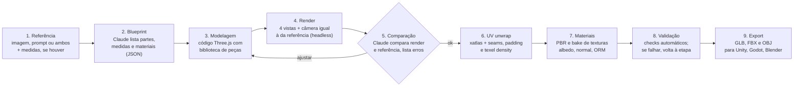

# 3D Studio — Spec & Roadmap

Sep 28, 2026 · @Tiago Xavier

## Visão e objetivos

O 3D Studio gera modelos 3D prontos para jogo a partir de uma imagem ou de um prompt de referência. O Claude modela em código (Three.js), vê o próprio resultado e refina até ficar fiel à referência. Tudo roda localmente, com ferramentas gratuitas e sem APIs pagas além da licença do Claude.

Objetivos:

1. **Entrada flexível:** uma ou mais imagens de referência, um prompt de texto, ou os dois juntos.
2. **Saída game-ready:** malha limpa, UVs abertas seguindo as regras deste documento e materiais PBR.
3. **Multi-engine:** o mesmo asset importa sem ajustes no Unity, no Godot 4 e no Blender.
4. **Editável:** cada modelo é um arquivo de código versionável, que pode ser reaberto, ajustado e regenerado.
5. **Repetível:** o fluxo inteiro dispara com um comando (`/modelar-3d`) e sempre segue as mesmas etapas e validações.

## Escopo

O sistema foca em assets hard-surface e estilizados, onde a modelagem por código gera resultados limpos e melhores que os de geradores de IA. Formas orgânicas realistas ficam fora da v1.

| Categoria | v1 | Observação |
| --- | --- | --- |
| Props e objetos (caixas, barris, ferramentas, eletrônicos) | Sim | Caso principal |
| Móveis e decoração | Sim | Caso principal |
| Arquitetura e kits modulares (paredes, portas, pisos) | Sim | Grid e snapping definidos no blueprint |
| Low-poly e estilizado | Sim | Paleta de cores ou atlas de gradiente |
| Peças técnicas e mecânicas | Sim | Precisão dimensional via blueprint |
| Veículos estilizados | Parcial | Carroceria simples; curvas complexas limitadas |
| Vegetação estilizada (árvores, rochas) | Parcial | Procedural com ruído |
| Personagens, rostos, animais realistas | Não | Possível na fase 6 com gerador local opcional |
| Rigging e animação | Não | Fora do escopo |
| Escultura e detalhe de alta frequência | Não | Simulado via normal map procedural |

Fidelidade esperada: forma, proporções e materiais fiéis à referência. Não é uma réplica fotogramétrica.

## Arquitetura e pipeline

Cada asset passa por 9 etapas. As etapas 3 a 5 formam um ciclo: o Claude renderiza o modelo, compara-o com a referência e ajusta o código até as diferenças serem aceitáveis (máximo de 5 iterações por padrão).



Peças principais:

- **Blueprint (`asset.json`):** descrição estruturada do asset: partes, dimensões em metros, materiais, orçamento de triângulos e engine-alvo. É o contrato entre a análise e a modelagem.
- **Gerador (`asset.js`):** módulo Three.js que lê o blueprint e constrói a cena. Usa uma biblioteca interna de peças (caixa chanfrada, cilindro, lathe, extrude, sweep, booleanas).
- **Estúdio headless:** página Three.js aberta via Playwright ou pelo browser do Claude. Renderiza as vistas de comparação e a textura de checker de UV.
- **CLI `studio3d`:** comandos `build`, `render`, `uv`, `validate` e `export`, que o Claude chama em sequência.
- **Skill `/modelar-3d`:** orquestra o fluxo e registra cada iteração no relatório do asset.

## Stack de ferramentas

Todas as ferramentas são gratuitas e open source e rodam em Node.js (a v24 já está instalada). Nenhuma exige Python nem conta em serviço externo.

| Ferramenta | Função no pipeline | Licença | Fase |
| --- | --- | --- | --- |
| Node.js 24 | Runtime da CLI `studio3d` | MIT | 0 |
| Three.js | Modelagem, render, GLTFExporter, OBJExporter | MIT | 0 |
| Playwright | Browser headless para render WebGL e screenshots | Apache-2.0 | 0 |
| manifold-3d | Operações booleanas (furos, recortes, uniões) com saída sempre watertight | Apache-2.0 | 1 |
| three-mesh-bvh | Raycast rápido para bake de AO e checagens | MIT | 1 |
| xatlas (build WASM) | UV unwrap, empacotamento e UV2 de lightmap | MIT | 2 |
| glTF-Transform | Weld, dedup, tangentes, compressão e inspeção de GLB | MIT | 2 |
| Khronos glTF-Validator | Validação formal do GLB exportado | Apache-2.0 | 2 |
| sharp | Redimensionar e converter texturas (PNG, WebP, KTX2 via toktx) | Apache-2.0 | 4 |
| meshoptimizer | Simplificação para LODs | MIT | 5 |
| assimpjs | Conversão GLB para FBX e OBJ | BSD-3 | 5 |
| Blender CLI (opcional) | Fallback headless para FBX, se o assimpjs falhar | GPL | 5 |
| TripoSR local (opcional) | Malha-base para formas orgânicas, na RTX 3060 | MIT | 6 |

No lado das engines, o Unity importa GLB com o pacote gratuito **glTFast**; o Godot 4 e o Blender importam GLB nativamente.

## Regras de UV e topologia

Todo asset sai com dois canais de UV: **UV0** para texturas e **UV1** para lightmap. Ambos são gerados e validados automaticamente. Os valores abaixo são padrões e podem ser sobrescritos no blueprint de cada asset.

### UV0: texturas

1. **Cobertura total:** todo vértice tem UV0; nenhuma face fica sem mapeamento.
2. **Espaço 0–1:** todas as ilhas ficam dentro de 0–1. A exceção são superfícies com tiling ou trim sheet declaradas no blueprint.
3. **Sem sobreposição:** 0% de overlap. Só é permitido quando o blueprint marca a peça como `mirror` ou `stack`, e nesse caso o bake usa uma única cópia.
4. **Seams em lugares certos:** em arestas vivas (≥ 60°) e em áreas pouco visíveis (base, costas, interior). Nunca no meio de uma superfície contínua visível.
5. **Hard edge = seam:** toda aresta com normal dividida também é seam de UV. Isso evita artefatos no normal map.
6. **Distorção baixa:** stretch de área e de ângulo ≤ 5% por ilha, medido pelo relatório do xatlas.
7. **Texel density uniforme:** variação ≤ ±10% entre ilhas do mesmo asset. Faces nunca vistas (fundo encostado no chão) podem ter 25% da densidade.
8. **Orientação:** ilhas retangulares ficam alinhadas a U ou V; madeira segue o veio; textos e logos ficam na direção de leitura.
9. **Aproveitamento:** as ilhas ocupam ≥ 70% do espaço UV.

| Categoria | Texel density | Textura típica |
| --- | --- | --- |
| Prop pequeno ou médio | 512 px/m | 1024² |
| Prop herói (close-up) | 1024 px/m | 2048² |
| Arquitetura e modulares | 512 px/m com tiling | 1024² tileável |
| Low-poly estilizado | Atlas de paleta (células de cor) | 256² a 512² |

| Resolução da textura | Padding entre ilhas | Margem da borda |
| --- | --- | --- |
| 512² | 4 px | 2 px |
| 1024² | 8 px | 4 px |
| 2048² | 16 px | 8 px |
| 4096² | 32 px | 16 px |

### UV1: lightmap

- Gerado pelo xatlas em todo asset marcado como `static` (arquitetura e props fixos).
- Sem sobreposição, dentro de 0–1 e com padding ≥ 2 texels na resolução de lightmap declarada (padrão de 128² por asset).
- Exportado como `TEXCOORD_1` no GLB. O Unity lê como canal UV1 (`Mesh.uv2`), o Godot como UV2 e o Blender como segundo UV map.

### Topologia e escala

- **Escala real:** 1 unidade = 1 metro, com dimensões dentro de ±2% do blueprint.
- **Eixos:** convenção glTF, com +Y para cima e a frente do asset voltada para +Z.
- **Pivot:** centro da base para props; canto inferior alinhado ao grid para modulares.
- **Malha limpa:** vértices soldados (weld), sem faces de área zero, sem arestas non-manifold e com normais para fora. Objetos fechados são watertight.
- **Suavização:** normais divididas por ângulo (padrão de 40°) ou chanfros reais.
- **Chanfros:** arestas visíveis têm chanfro de 2 a 5 mm para pegar luz, exceto no estilo low-poly facetado.
- **Orçamento de triângulos:** prop pequeno 300 a 1.500; prop médio 1.500 a 5.000; prop herói 5.000 a 15.000; módulo de arquitetura 200 a 2.000.

## Export por engine

O GLB é o formato mestre: um único arquivo abre corretamente nas três engines. O FBX e o OBJ são derivados dele, para pipelines que ainda os exigem.

| Aspecto | Unity | Godot 4 | Blender |
| --- | --- | --- | --- |
| Formato principal | GLB via glTFast | GLB nativo | GLB nativo |
| Formato alternativo | FBX (binary) | — | FBX, OBJ |
| Material | URP Lit (convertido pelo glTFast) | StandardMaterial3D | Principled BSDF |
| UV de lightmap | Canal UV1 (`TEXCOORD_1`) | UV2 (`TEXCOORD_1`) | Segundo UV map |
| Colisão | Malha `<nome>_col` vira MeshCollider via script de import | Sufixo `-col` ou `-colonly` no nó (hint nativo) | Objeto separado `<nome>_col` |
| LODs | Nós `_LOD0` a `_LOD2` viram LODGroup via script de import | Nós `_LOD` separados, ou LOD automático do importador | Objetos separados por LOD |
| Import automatizado | Via unity-mcp (já conectado) | Pasta `res://` + reimport | Script `bpy` opcional |

Pacote gerado por asset:

- `SM_<Nome>.glb`, com texturas embutidas
- `SM_<Nome>.fbx` e `SM_<Nome>.obj` + `.mtl`
- `textures/`, com PNGs soltos: `T_<Nome>_BaseColor`, `T_<Nome>_Normal` (OpenGL, Y+) e `T_<Nome>_ORM` (R = AO, G = roughness, B = metallic)
- `preview.png`: as quatro vistas lado a lado com a referência
- `report.json`: resultado de todas as validações

No Unity, o normal map OpenGL (Y+) é o padrão. No Godot e no Blender também, então nenhuma engine precisa inverter o canal verde.

## Validação e critérios de aceite

Um asset só é exportado quando passa em todos os checks bloqueantes. O comando `studio3d validate` gera o `report.json`, e o Claude corrige as falhas antes de seguir.

| Check | Critério | Ferramenta | Bloqueia |
| --- | --- | --- | --- |
| GLB válido | 0 erros, 0 warnings | glTF-Validator | Sim |
| UV0 presente | 100% dos vértices | studio3d | Sim |
| UV0 overlap | 0% (exceto `mirror` e `stack`) | studio3d (rasterização) | Sim |
| UV0 fora de 0–1 | 0 ilhas (exceto tiling declarado) | studio3d | Sim |
| Padding | ≥ tabela de padding | studio3d | Sim |
| Texel density | ±10% entre ilhas | studio3d | Não (alerta) |
| Distorção | ≤ 5% por ilha | xatlas | Não (alerta) |
| UV1 lightmap | Presente e sem overlap se `static` | studio3d | Sim |
| Malha | Manifold, sem faces de área zero, normais para fora | three-mesh-bvh + studio3d | Sim |
| Dimensões | ±2% do blueprint | studio3d (bounding box) | Sim |
| Triângulos | Dentro do orçamento da categoria | glTF-Transform inspect | Sim |
| Texturas | Potência de 2, no tamanho declarado | sharp | Sim |
| Fidelidade visual | Nota ≥ 8/10 do Claude em cada vista | Claude (visão) | Sim |

Critérios de aceite da v1, medidos em um conjunto de 10 referências de teste:

- [ ] 10 de 10 assets passam em todos os checks bloqueantes
- [ ] Cada asset importa sem erros no Unity (glTFast), no Godot 4 e no Blender
- [ ] A textura de checker não mostra esticamento visível em nenhuma vista
- [ ] O lightmap bake no Unity não mostra vazamentos (light bleeding) nas seams
- [ ] Tempo médio de uma referência até o pacote final abaixo de 15 minutos

## Estrutura de pastas e convenções

O tooling fica em `www/projects/3D Studio/` (fora do projeto Unity, para o `node_modules` não entrar no import). O `studio3d export` copia só o pacote final para `dist/<nome>/`. Cada asset tem uma pasta própria com a referência, o código-fonte e o pacote exportado.

```
3d-studio/
  package.json
  cli/                 # comandos studio3d (build, render, uv, validate, export)
  lib/
    parts/             # biblioteca de peças: bevelBox, lathe, extrude, sweep, csg
    materials/         # materiais PBR procedurais e bake de texturas
    uv/                # wrapper do xatlas, regras e métricas
    validate/          # checks do report.json
  studio/
    index.html         # estúdio headless: luzes, câmeras, checker
  assets/
    <nome>/
      ref/             # imagens de referência e prompt.md
      asset.json       # blueprint
      asset.js         # gerador Three.js
      iterations/      # renders de cada iteração
      out/             # SM_<Nome>.glb, .fbx, .obj, textures/, preview.png, report.json
  .claude/skills/modelar-3d/SKILL.md
```

| Item | Convenção | Exemplo |
| --- | --- | --- |
| Pasta do asset | kebab-case | `cadeira-madeira` |
| Malha estática | `SM_` + PascalCase | `SM_CadeiraMadeira` |
| Textura | `T_<Nome>_<Mapa>` | `T_CadeiraMadeira_ORM` |
| Material | `M_<Nome>_<Parte>` | `M_CadeiraMadeira_Assento` |
| Colisão | `<malha>_col` | `SM_CadeiraMadeira_col` |
| LOD | `<malha>_LOD<n>` | `SM_CadeiraMadeira_LOD1` |

## Roadmap

O MVP (referência vira asset aprovado) fecha no fim da F3. A F4 e a F5 levam o asset a padrão de produção, e a F6 é opcional. Cada fase só avança quando o seu gate é cumprido. As datas ficam para definir.

| Fase | Entregas | Gate de saída |
| --- | --- | --- |
| **F0 · Fundação** | Projeto Node, Three.js, estúdio headless com Playwright, export GLB de um cubo de teste | O GLB de teste abre no Unity, no Godot e no Blender |
| **F1 · Biblioteca de peças** | bevelBox, lathe, extrude, sweep e CSG; schema do blueprint (asset.json); normais por ângulo | 3 props feitos só com a biblioteca |
| **F2 · UV e validação** | xatlas (UV0 + UV1), seams por ângulo, padding, texel density, checker e report.json | report.json sem falhas bloqueantes nos 3 props |
| **F3 · Referência para modelo (MVP)** | Skill /modelar-3d, blueprint a partir de imagem ou prompt, render de 4 vistas, ciclo de comparação | **MVP: 5 referências reais viram assets aprovados** |
| **F4 · Materiais e texturas** | PBR procedural, bake de BaseColor, Normal e ORM, AO via raycast, atlas de paleta low-poly | Texturas passam no checker e no bake de lightmap |
| **F5 · Export multi-engine** | FBX e OBJ via assimpjs, LODs com meshoptimizer, colisores, import automático no Unity via MCP | Critérios de aceite da v1 (10 de 10 assets) |
| **F6 · Extras (opcional)** | TripoSR local para formas orgânicas, kits modulares com snapping, geração em lote | — |

A ordem prioriza UV e validação (F2) antes do ciclo com referência (F3): as regras de UV passam a ser garantidas desde o primeiro asset gerado.

## Riscos e questões em aberto

| Risco | Impacto | Mitigação |
| --- | --- | --- |
| Formas curvas complexas ficam genéricas | Fidelidade baixa em veículos e orgânicos | Peças sweep e lathe, subdivisão; TripoSR local na F6 |
| Seams automáticos do xatlas em lugares visíveis | Viola as regras de UV | Seams definidos por peça no gerador; xatlas só empacota |
| assimpjs gera FBX com eixos ou escala errados | Import quebrado no Unity | Teste na F0; fallback para Blender CLI headless |
| WebGL headless sem GPU no Playwright | Render lento ou diferente | Forçar GPU (RTX 3060) ou usar o browser do Claude |
| Nota visual do Claude varia entre iterações | Critério de aprovação instável | Checklist fixo por vista, anotado no report.json |
| Uso de tokens alto por asset (várias iterações com imagem) | Limite da licença | Teto de 5 iterações; renders em 768 px |

Questões em aberto:

- [ ] Qual pipeline de render é o alvo no Unity: URP, HDRP ou Built-in?
- [ ] O GLB com glTFast basta no Unity, ou o FBX é obrigatório no fluxo da equipe?
- [ ] Os padrões de texel density (512 px/m para props) servem para os projetos atuais?
- [ ] Qual o estilo visual predominante: realista PBR ou estilizado/low-poly?
- [ ] Quais são as 10 referências do conjunto de teste da v1?
