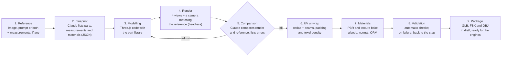

# Meshsmith — Spec & Roadmap

Sep 28, 2026 · @Tiago Xavier

## Vision and goals

Meshsmith generates game-ready 3D models from a reference image or a prompt. Claude models in code (Three.js), looks at its own result and refines it until it is faithful to the reference. Everything runs locally, with free tools and no paid APIs beyond the Claude licence.

Goals:

1. **Flexible input:** one or more reference images, a text prompt, or both together.
2. **Game-ready output:** a clean mesh, UVs unwrapped according to the rules in this document, and PBR materials.
3. **Multi-engine and independent:** the tool is a project of its own, outside any engine. It produces a standard package (GLB, FBX, OBJ) that imports without adjustment into Unity, Godot 4 and Blender. The engine import test only happens in the last phase.
4. **Editable:** every model is a versionable code file that can be reopened, adjusted and regenerated.
5. **Repeatable:** the whole flow starts with one command (`/model-3d`) and always follows the same steps and validations.
6. **Two styles:** realistic (PBR) and low-poly, chosen per asset in the blueprint.

## Scope

The system focuses on hard-surface and stylised assets, where modelling in code gives cleaner and better results than AI generators. Realistic organic shapes are out of scope for v1.

| Category | v1 | Note |
| --- | --- | --- |
| Props and objects (crates, barrels, tools, electronics) | Yes | The main case |
| Furniture and decoration | Yes | The main case |
| Architecture and modular kits (walls, doors, floors) | Yes | Grid and snapping defined in the blueprint |
| Low-poly and stylised | Yes | Colour palette or gradient atlas |
| Technical and mechanical parts | Yes | Dimensional accuracy via the blueprint |
| Stylised vehicles | Partial | Simple bodywork; complex curves limited |
| Stylised vegetation (trees, rocks) | Partial | Procedural with noise |
| Characters, faces, realistic animals | No | Possible in F6 with an optional local generator |
| Rigging and animation | No | Out of scope |
| Sculpting and high-frequency detail | No | Simulated with a procedural normal map |

Expected fidelity: shape, proportions and materials faithful to the reference. It is not a photogrammetric replica.

## Visual styles

Both styles are predominant and carry the same weight. The blueprint picks one per asset (`"style": "pbr" | "lowpoly"`). The generator can read `bp.style` to serve both, and the same part produces both versions by changing only the blueprint.

| Aspect | Realistic (PBR) | Low-poly |
| --- | --- | --- |
| Geometry | 2 to 5 mm chamfers, area-weighted normals smoothed up to 50° | Faceted (per-face normals), no chamfers, the `lowpoly` category's budget |
| UV0 | Unique islands via xatlas, the category's texel density | Palette: every face points at the cell for its material's colour (overlap on purpose) |
| Textures | `BaseColor`, `Normal` (OpenGL) and `ORM`, procedural bake from 512² to 2048² | `T_<Name>_Palette` at 256², no normal map |
| Materials | Procedural presets: wood, painted metal, bare metal, plastic, rubber, concrete, fabric | Flat palette colours, optional vertical gradient per material |
| AO | Raycast bake into the ORM | Not used (the faceted shading already reads the form) |
| UV1 (lightmap) | xatlas | xatlas (same as PBR) |

## Architecture and pipeline

Every asset goes through 9 steps. Steps 3 to 5 form a loop: Claude renders the model, compares it against the reference and adjusts the code until the differences are acceptable (5 iterations at most by default).



The main pieces:

- **Blueprint (`asset.json`):** a structured description of the asset: parts, dimensions in metres, materials, triangle budget and target engine. It is the contract between analysis and modelling.
- **Generator (`asset.js`):** a Three.js module that reads the blueprint and builds the scene. It uses an internal part library (bevelled box, cylinder, lathe, extrude, sweep, booleans).
- **Headless studio:** a Three.js page opened through Playwright or through Claude's browser. It renders the comparison views and the UV checker texture.
- **The `meshsmith` CLI:** the commands `build`, `render`, `uv`, `validate` and `export`, which Claude calls in sequence.
- **The `/model-3d` skill:** orchestrates the flow and records every iteration in the asset's report.

## Tool stack

Every tool is free and open source and runs on Node.js (v24 is already installed). None of them needs Python or an account on an external service.

| Tool | Role in the pipeline | Licence | Phase |
| --- | --- | --- | --- |
| Node.js 24 | Runtime for the `meshsmith` CLI | MIT | 0 |
| Three.js | Modelling, rendering, GLTFExporter, OBJExporter | MIT | 0 |
| Playwright | Headless browser for WebGL rendering and screenshots | Apache-2.0 | 0 |
| manifold-3d | Boolean operations (holes, cut-outs, unions) with always-watertight output | Apache-2.0 | 1 |
| three-mesh-bvh | Fast raycasting for the AO bake and for checks | MIT | 4 |
| mikktspace (WASM) | MikkTSpace tangents matching the engines', for the normal map | MIT | 4 |
| xatlas (WASM build) | UV unwrap, packing and lightmap UV2 | MIT | 2 |
| glTF-Transform | Weld, dedup, tangents, compression and GLB inspection | MIT | 2 |
| Khronos glTF-Validator | Formal validation of the exported GLB | Apache-2.0 | 2 |
| sharp | Resizing and converting textures (PNG, WebP, KTX2 via toktx) | Apache-2.0 | 4 |
| meshoptimizer | Simplification for LODs | MIT | 5 |
| assimpjs | Re-reading the exported FBX and OBJ (automatic verification); assimp only imports FBX | BSD-3 | 5 |
| meshsmith (own writer) | Binary FBX 7.4 and OBJ/MTL export | — | 5 |
| Blender CLI (optional) | Headless fallback for FBX, should the own writer fail in some engine | GPL | 7 |
| Local TripoSR (optional) | A base mesh for organic shapes, on the RTX 3060 | MIT | 6 |

On the engine side, Unity imports GLB with the free **glTFast** package; Godot 4 and Blender import GLB natively.

## UV and topology rules

Every asset ships with two UV channels: **UV0** for textures and **UV1** for the lightmap. Both are generated and validated automatically. The values below are defaults and can be overridden in each asset's blueprint.

### UV0: textures

1. **Full coverage:** every vertex has a UV0; no face is left unmapped.
2. **The 0–1 space:** every island sits inside 0–1. The exception is surfaces with tiling or a trim sheet declared in the blueprint.
3. **No overlap:** 0% overlap. It is only allowed when the blueprint marks the part as `mirror` or `stack`, and in that case the bake uses a single copy.
4. **Seams in the right places:** on hard edges (≥ 60°) and in barely visible areas (the base, the back, the inside). Never in the middle of a visible continuous surface. `meshsmith` defines the charts (chamfers stay with their face, closed bands are cut along the back line) and xatlas only parameterises and packs.
5. **Hard edge = seam:** every edge with split normals is also a UV seam. That avoids normal-map artefacts.
6. **Low distortion:** area and angle stretch ≤ 5% per island, measured from xatlas' report.
7. **Uniform texel density:** variation ≤ ±10% between islands of the same asset. Faces that are never seen (a bottom resting on the floor) may have 25% of the density.
8. **Orientation:** rectangular islands stay aligned to U or V; wood follows the grain; text and logos sit in reading direction.
9. **Utilisation:** the islands take up ≥ 70% of the UV space.

| Category | Texel density | Typical texture |
| --- | --- | --- |
| Small or medium prop | 512 px/m | 1024² |
| Hero prop (close-up) | 1024 px/m | 2048² |
| Architecture and modulars | 512 px/m with tiling | 1024² tileable |
| Stylised low-poly | Palette atlas (colour cells) | 256² to 512² |

| Texture resolution | Padding between islands | Border margin |
| --- | --- | --- |
| 256² | 2 px | 1 px |
| 512² | 4 px | 2 px |
| 1024² | 8 px | 4 px |
| 2048² | 16 px | 8 px |
| 4096² | 32 px | 16 px |

### UV1: lightmap

- Generated by xatlas on every asset marked `static` (architecture and fixed props).
- No overlap, inside 0–1 and with padding ≥ 2 texels at the declared lightmap resolution (128² per asset by default).
- Exported as `TEXCOORD_1` in the GLB. Unity reads it as the UV1 channel (`Mesh.uv2`), Godot as UV2 and Blender as the second UV map.

### Topology and scale

- **Real-world scale:** 1 unit = 1 metre, with dimensions within ±2% of the blueprint.
- **Axes:** the glTF convention, with +Y up and the front of the asset facing +Z.
- **Pivot:** the centre of the base for props; the bottom corner aligned to the grid for modulars.
- **Clean mesh:** welded vertices, no zero-area faces, no non-manifold edges and normals facing out. Closed objects are watertight.
- **Smoothing:** area-weighted normals split by angle (50° by default, so 45° chamfers stay smooth and catch the light) or real chamfers.
- **Chamfers:** visible edges get a 2 to 5 mm chamfer to catch the light, except in the faceted low-poly style.
- **Triangle budget:** small prop 300 to 1,500; medium prop 1,500 to 5,000; hero prop 5,000 to 15,000; architecture module 200 to 2,000.

## Export per engine

The GLB is the master format: a single file opens correctly in all three engines. The FBX and the OBJ are derived from it, for pipelines that still require them. The tool does not write into engine projects: it produces the package in `dist/<name>/` (plus a `.zip`), and whoever uses it copies that into their project. The engine-side import scripts (LODGroup and colliders in Unity) live in `unity/com.meshsmith.import` and are tested in F7.

| Aspect | Unity | Godot 4 | Blender |
| --- | --- | --- | --- |
| Main format | FBX (binary), the team's standard | GLB natively | GLB natively |
| Alternative format | GLB via glTFast | — | FBX, OBJ |
| Material | URP Lit (converted by glTFast) | StandardMaterial3D | Principled BSDF |
| Lightmap UV | The UV1 channel (`TEXCOORD_1`) | UV2 (`TEXCOORD_1`) | The second UV map |
| Collision | The `<name>_col` mesh becomes a MeshCollider through the import script | The `-col` or `-colonly` suffix on the node (a native hint) | A separate `<name>_col` object |
| LODs | The `_LOD0` to `_LOD2` nodes become a LODGroup through the import script | Separate `_LOD` nodes, or the importer's automatic LOD | Separate objects per LOD |

The package produced per asset (`dist/<name>/`):

- `SM_<Name>.glb`, with the textures embedded
- `SM_<Name>.fbx` (binary 7.4, with UV1 and LODs) and `SM_<Name>.obj` + `.mtl` (LOD0 and the collider only)
- Inside the GLB and the FBX: `SM_<Name>_LOD0` to `_LOD2` (from 600 triangles up) and `SM_<Name>_col` (a convex hull, ≤ 256 triangles)
- `textures/`, with loose PNGs: `T_<Name>_BaseColor`, `T_<Name>_Normal` (OpenGL, Y+) and `T_<Name>_ORM` (R = AO, G = roughness, B = metallic). In low-poly, only `T_<Name>_Palette`
- `preview.png`: the four views side by side with the reference
- `report.json`: the result of every validation

In Unity, the OpenGL (Y+) normal map is the default. In Godot and Blender too, so no engine needs the green channel flipped.

## Validation and acceptance criteria

An asset is only exported once it passes every blocking check. The `meshsmith validate` command produces `report.json`, and Claude fixes the failures before moving on.

| Check | Criterion | Tool | Blocking |
| --- | --- | --- | --- |
| GLB valid | 0 errors, 0 warnings | glTF-Validator | Yes |
| UV0 present | 100% of vertices | meshsmith | Yes |
| UV0 overlap | 0% (except `mirror`, `stack` and the low-poly palette) | meshsmith (rasterisation) | Yes |
| UV0 outside 0–1 | 0 islands (except declared tiling) | meshsmith | Yes |
| Padding | ≥ the padding table | meshsmith | Yes |
| Texel density | ±10% between islands | meshsmith | No (warning) |
| Distortion | ≤ 5% per island | xatlas | No (warning) |
| UV1 lightmap | Present and free of overlap when `static` | meshsmith | Yes |
| Mesh | Manifold, no zero-area faces, normals facing out | three-mesh-bvh + meshsmith | Yes |
| Dimensions | ±2% of the blueprint | meshsmith (bounding box) | Yes |
| Triangles | Within the category's budget | glTF-Transform inspect | Yes |
| Textures | Power of two, at the declared size; island borders dilated (no background bleeding) | sharp | Yes |
| Palette (low-poly) | Every face inside a palette cell | meshsmith | Yes |
| Visual fidelity | A score ≥ 8/10 from Claude on every view | Claude (vision) | Yes |

The v1 acceptance criteria, measured over a set of 10 test references:

- [ ] 10 out of 10 assets pass every blocking check
- [ ] At least 3 assets of each style (realistic and low-poly) in the set
- [ ] Every asset imports without errors into Unity (FBX), Godot 4 and Blender (tested in F7)
- [ ] The checker texture shows no visible stretching on any view
- [ ] The lightmap bake in Unity shows no light bleeding at the seams (tested in F7)
- [ ] A mean time from reference to final package under 15 minutes

## Folder structure and conventions

The tool is an independent project, with no dependency on any engine project. Each asset has its own folder with the reference, the source code and the build output. `meshsmith export` assembles the final package in `dist/<name>/` and `dist/<name>.zip`.

```
Meshsmith/
  package.json
  cli/                 # meshsmith commands (new, build, render, uv, validate, export)
  lib/
    parts/             # part library: bevelBox, lathe, extrude, sweep, csg
    materials/         # procedural PBR materials and the texture bake
    uv/                # the xatlas wrapper, rules and metrics
    validate/          # the report.json checks
  studio/
    index.html         # headless studio: lights, cameras, checker
  assets/
    <name>/
      ref/             # reference images and prompt.md
      asset.json       # blueprint
      asset.js         # Three.js generator
      iterations/      # the renders of each iteration
      out/             # build output: SM_<Name>.glb, textures/, report.json
      review.json      # the visual assessment (a checklist per view)
  dist/
    <name>/            # final package: .glb, .fbx, .obj, textures/, preview.png, report.json
  templates/           # the asset skeleton for `meshsmith new`
  tools/               # diagnostic scripts (UV, topology)
  .claude/skills/model-3d/SKILL.md
```

| Item | Convention | Example |
| --- | --- | --- |
| Asset folder | kebab-case | `wood-chair` |
| Static mesh | `SM_` + PascalCase | `SM_WoodChair` |
| Texture | `T_<Name>_<Map>` | `T_WoodChair_ORM` |
| Material | `M_<Name>_<Part>` | `M_WoodChair_Seat` |
| Collision | `<mesh>_col` | `SM_WoodChair_col` |
| LOD | `<mesh>_LOD<n>` | `SM_WoodChair_LOD1` |

## Roadmap

The MVP (a reference becomes an approved asset) closes at the end of F3. F4 and F5 bring the asset up to production standard in both styles, without depending on any engine. F6 brings the extras (modular kits, batch). The import tests are left for F7, the last phase of v1. Each phase only moves on once its gate is met. The dates are still to be decided.

| Phase | Deliverables | Exit gate | Status |
| --- | --- | --- | --- |
| **F0 · Foundation** | Node project, Three.js, headless studio with Playwright, a GLB of a test cube | The GLB passes the glTF-Validator and renders correctly in the studio | Done |
| **F1 · Part library** | bevelBox, cylinder, lathe, extrude, sweep and CSG; the blueprint schema (asset.json); normals by angle | 3 props built with the library alone | Done |
| **F2 · UV and validation** | xatlas (UV0 + UV1), seams by angle, padding, texel density, checker and report.json | report.json with no blocking failures on the 3 props | Done |
| **F3 · Reference to model (MVP)** | The /model-3d skill, a blueprint from an image or a prompt, a render of 4 views, the comparison loop | **MVP: 5 real references become approved assets** | 4 of 5 references approved (extinguisher, Adirondack chair, cone, upholstered chair); 1 to go |
| **F4 · Materials and styles** | Procedural PBR presets, a bake of BaseColor, Normal and ORM, AO via raycast, the low-poly style (faceted + palette) | 1 asset of each style with approved textures: checker, material view and texture checks | Done |
| **F5 · Export package** | Binary FBX and OBJ (own writers, re-read by assimpjs), LODs with meshoptimizer, colliders, the `dist/<name>/` package + zip | 10 assets (at least 3 of each style) with a complete package and passing checks, including the FBX and OBJ re-read | Done |
| **F6 · Extras** | Modular kits with a grid, snapping and tileable textures; batch generation; local TripoSR for organic shapes (optional, needs Python/CUDA) | A validated modular architecture kit and a batch of the 10+ assets in one command | The kit (wall, wall with door, floor, pillar) and `meshsmith batch` are done (14/14); TripoSR outstanding |
| **F7 · Engine tests (last)** | Import into Unity via FBX (the team's main format) with the `unity/com.meshsmith.import` package (LODGroup, colliders), lightmap bake; GLB via glTFast optional; Godot and Blender if installed | The v1 acceptance criteria | The Unity package is ready; the test is deferred to the end |

The order puts UV and validation (F2) before the reference loop (F3): the UV rules are then guaranteed from the very first generated asset.

## Risks and open questions

| Risk | Impact | Mitigation |
| --- | --- | --- |
| Complex curved shapes come out generic | Low fidelity on vehicles and organics | Sweep and lathe parts, subdivision; local TripoSR in F6 (optional) |
| xatlas' automatic seams land in visible places | Breaks the UV rules | Seams defined per part in the generator; xatlas only packs |
| assimpjs produces an FBX with the wrong axes or scale | A broken import in Unity | An automatic FBX re-read in F5; a real test in F7; a fallback to the headless Blender CLI |
| Headless WebGL without a GPU in Playwright | A slow or different render | Force the GPU (RTX 3060) or use Claude's browser |
| Claude's visual score varies between iterations | An unstable approval criterion | A fixed checklist per view, recorded in report.json |
| High token use per asset (several iterations with an image) | The licence's limit | A ceiling of 5 iterations; renders at 768 px |

Open questions:

- [ ] Which render pipeline is the target in Unity: URP, HDRP or Built-in? (needed in F7)
- [x] Is GLB with glTFast enough in Unity, or is FBX mandatory in the team's flow? FBX is the main format in Unity; GLB stays as the master format and for Godot/Blender
- [ ] Do the texel density defaults (512 px/m for props) suit the current projects?
- [x] Which visual style is predominant? Both: realistic (PBR) and low-poly (see "Visual styles")
- [x] What are the 10 references of the v1 test set? crate, drum, bracket, stool (PBR and low-poly), extinguisher, Adirondack chair (low-poly), cone and upholstered chair
