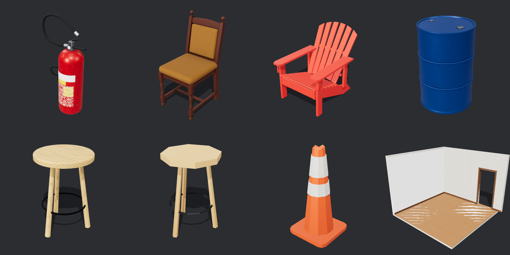

# Meshsmith



A local pipeline that turns a reference photo or a text prompt into a
game-ready 3D asset: the model is written as code (Three.js), rendered,
compared against the reference and refined until it matches, then unwrapped,
textured, validated and exported for Unity, Godot and Blender.

> **Status:** roadmap phases F0–F6 done (F3 has 4 of its 5 real references;
> the optional TripoSR step is not included). Engine import tests (F7) are
> the last open phase. A personal study project — see the
> [spec & roadmap](Meshsmith%20-%20Spec%20%26%20Roadmap.md) (in Portuguese)
> for how it was built, phase by phase.

## Examples

Every asset lives in `assets/<name>/` with its blueprint (`asset.json`), its
generator (`asset.js`) and, when it came from a photo, the reference in `ref/`:

- **From real photos:** `extintor-agua` (water extinguisher),
  `cadeira-estofada` (upholstered dining chair), `cadeira-adirondack`
  (low-poly), `cone-transito` (low-poly traffic cone).
- **From prompts:** `caixa-madeira` (crate), `tambor-metal` (steel drum),
  `suporte-metalico` (L bracket), `banco-madeira` (stool).
- **Both styles, one generator:** `banco-madeira` (PBR) and
  `banco-madeira-lp` (low-poly) share the same `asset.js`.
- **Modular kit:** `kit-parede`, `kit-parede-porta`, `kit-piso`, `kit-pilar`,
  on a shared grid with snap sockets and seamless tiling textures.

## Why Meshsmith

AI mesh generators give you a blob; hand modelling takes hours. Meshsmith sits
in between for hard-surface props, furniture and architecture:

- **The model is code** — each asset is a small, versionable generator built
  from a part library (bevelled boxes, lathe, loft, extrude, sweep, watertight
  CSG), so a change is an edit, not a re-sculpt.
- **Game-ready by construction** — real-world scale, pivot on the base,
  UV0 without overlaps plus a UV1 lightmap, baked PBR maps (BaseColor, Normal,
  ORM) with procedural wear, LODs and a convex collider.
- **Validated, not eyeballed** — every build writes a `report.json` (glTF
  validator, UV coverage/overlap/padding/texel density, watertight parts,
  dimensions, triangle budget, visual score) and the export is blocked until
  the blocking checks pass.
- **Two styles** — realistic PBR or low-poly (faceted geometry and a palette
  texture) from the same generator.
- **Fully local and free** — Node.js, Three.js, xatlas, manifold-3d,
  meshoptimizer; no paid APIs.

## Requirements

- Node.js `24`
- Chromium for Playwright (headless WebGL rendering; a GPU is used when available)
- Optional: Unity `2022.3+` for the import package in `unity/com.meshsmith.import`

## Installation

```bash
git clone https://github.com/tiago-xavier-braga/Meshsmith.git
cd Meshsmith
npm install
npx playwright install chromium
```

## Usage

```bash
# Scaffold a new asset (ref/, prompt.md, asset.json, asset.js)
node cli/meshsmith.js new cadeira-madeira

# Build + render the comparison sheet (reference photos next to the renders)
node cli/meshsmith.js render cadeira-madeira

# Run every check and write out/report.json
node cli/meshsmith.js validate cadeira-madeira

# Package dist/cadeira-madeira/ (GLB, FBX, OBJ, textures, preview, report) + .zip
node cli/meshsmith.js export cadeira-madeira

# Validate or export many assets at once, summary in dist/batch-report.md
node cli/meshsmith.js batch --step export
```

A blueprint describes the asset; the generator builds it from the part library:

```json
{
  "name": "mesa-lateral",
  "meshName": "SM_MesaLateral",
  "category": "prop-medium",
  "style": "pbr",
  "dimensions": { "x": 0.5, "y": 0.55, "z": 0.5 },
  "materials": { "wood": { "color": "#8a5a34", "roughness": 0.6, "preset": "wood" } },
  "parts": [{ "id": "top", "material": "wood" }, { "id": "leg", "material": "wood" }]
}
```

```js
// assets/mesa-lateral/asset.js — metres, Y up, front towards +Z, pivot on the base
export default function build(bp, { parts: P, materials }) {
  const a = P.assembly(bp, materials);
  a.add('top', P.bevelBox({ size: [0.5, 0.03, 0.5], bevel: 0.004 }), { position: [0, 0.52, 0] });
  for (const x of [-0.21, 0.21]) for (const z of [-0.21, 0.21])
    a.add('leg', P.cylinder({ radius: 0.018, height: 0.52 }), { position: [x, 0, z] });
  return a.build();
}
```

With [Claude Code](https://claude.com/claude-code), the `/modelar-3d` skill
(`.claude/skills/modelar-3d/`) runs the whole loop: reference, blueprint,
generator, render-compare iterations, validation and export. The part library
is documented in [lib/parts/README.md](lib/parts/README.md).

## Output

`dist/<name>/` holds `SM_<Name>.glb` (master format, textures embedded, LOD0–2,
`_col` collider and `SOCKET_*` snap points), `SM_<Name>.fbx` (binary 7.4),
`SM_<Name>.obj` + `.mtl`, loose `textures/`, `preview.png` and `report.json`.
FBX and OBJ are read back with assimp on every export and must match the GLB.

## Credits

Reference photos in `assets/*/ref/` come from Wikimedia Commons under their
own licences; author and licence for each file are listed in its `SOURCES.md`.
They are not covered by the project licence.

## License

[MIT](LICENSE)
